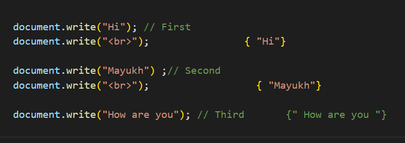
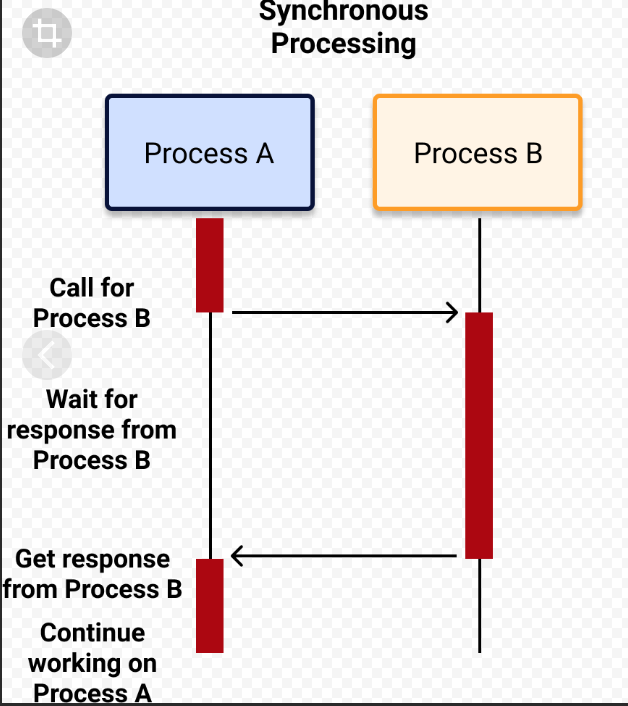

> ## SYNCHRONOUS
 >Синхронный JavaScript: Как следует из названия, синхронный означает быть в последовательности, т.е. каждый оператор кода выполняется один за другим. Итак, по сути, оператор должен ждать выполнения предыдущего оператора.
Давайте разберемся в этом с помощью примера.

